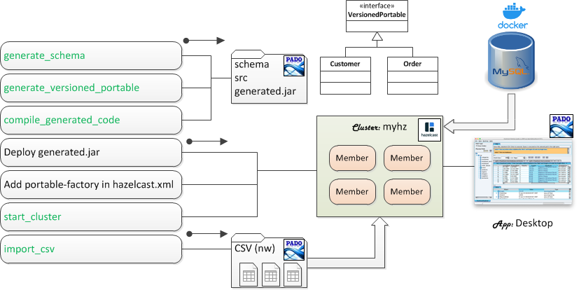

 [*PadoGrid*](https://github.com/padogrid) | [*Catalogs*](https://github.com/padogrid/catalog-bundles/blob/master/all-catalog.md) | [*Manual*](https://github.com/padogrid/padogrid/wiki) | [*FAQ*](https://github.com/padogrid/padogrid/wiki/faq) | [*Releases*](https://github.com/padogrid/padogrid/releases) | [*Templates*](https://github.com/padogrid/padogrid/wiki/Using-Bundle-Templates) | [*Pods*](https://github.com/padogrid/padogrid/wiki/Understanding-Padogrid-Pods) | [*Kubernetes*](https://github.com/padogrid/padogrid/wiki/Kubernetes) | [*Docker*](https://github.com/padogrid/padogrid/wiki/Docker) | [*Apps*](https://github.com/padogrid/padogrid/wiki/Apps) | [*Quick Start*](https://github.com/padogrid/padogrid/wiki/Quick-Start)

---

# App: Pado

The pado app provides a Hazelcast `Portable` class generator and CSV file import tools for Hazelcast. This bundle includes step-by-step instructions for ingesting mock data and UCI Machine Learning datasets into Hazelcast. It also includes a Pado scheduler demo that automates scheduled job executions for exporting and importing data from databases.

## Installing Bundle

```bash
install_bundle -download bundle-hazelcast-3n4n5-app-pado
```

:exclamation: **The Pado scheduler currently does not support Cygwin.**

## Use Case

This use case introduces Pado for ingesting CSV file contents in the form of `VersionedPortable` objects into a Hazelcast cluster.




## Building Pado

```bash
cd_app pado; cd bin_sh
./build_app
```

The `build_app` script builds and deploys Pado in the `pado` app directory. You can check the directory contents as follows, where `<version>` is the Pado version.

```bash
ls ../pado_<version>
```

## Pado CSV `data` Directory

The Pado CSV `data` directory structure includes the `import` directory where you place the CSV files to import and the `schema` directory in which you provide schema files that define how to parse the CSV files. Pado automatically moves the successfully imported files from the `import` directory to the `processed` directory. It moves the unsuccessful ones in the `error` directory.

```console
data
├── error
├── import
├── processed
└── schema
```

## Running Pado CSV Importer

The Pado CSV importer facility automatically generates schema files, generates and compiles `VersionedPortable` classes, and imports CSV file contents into Hazelcast in the form of `VersionedPortable` objects. The imported data can then be viewed using the `desktop` app. These steps are shown in sequence below.

1. Place CSV files in the `data/import/` directory.
2. Generate schema files using the CSV files in `data/import/`.
3. Generate `VersionedPortable` source code.
4. Compile and create a `VersionedPortable` jar file.
5. Deploy the generated jar file to a Hazelcast cluster and add the `Portable` factory class in hazelcast.xml.
6. Start a Hazelcast cluster.
7. Import CSV files.
8. View imported data using the `desktop` app.

## NW Demo

For our demo, let's import the NW sample data included in the Pado distribution into Hazelcast. To import data in CSV files, you need to first generate schema files. Pado provides the `generate_schema` command which auto-generates schema files based on CSV file contents. Once you have schema files ready, then you can generate Hazelcast `VersionedPortable` classes by executing the `generate_versioned_portable` command.

0. Create a Hazelcast cluster.

For our demo, we will use the default cluster, `myhz`, which can be created as follows.

```bash
make_cluster -product hazelcast -cluster myhz
```

1. Change directory to the `pado` directory and copy the NW CSV files to the import directory. 

```bash
cd_app pado
cd pado_<version>

# Copy CSV files into data/import
cp -r data/nw/import data/
```

2. Generate schema files.

Generate schema files for the `nw` data

```bash
# Generate schema files. The following command generates schema files in the
# data/schema/generated directory.
cd bin_sh/hazelcast
./generate_schema

# Move the generated schema files to data/schema.
mv ../../data/schema/generated/* ../../data/schema/
```

:exclamation: If `generate_schema` fails due to a Java path issue, then you can set `JAVA_HOME` in the `setenv.sh` file as shown below.

```bash
# pado_<version>/bin_sh/setenv.sh
vi ../setenv.sh
```

3. Generate `VersionedPortable` source code. The following command reads schema files located in data/schema/ and generates the corresponding `VersionedPortable Java source code.

```bash
# Generate VersionedPortable classes with the factory ID of 30000 and the
# start class ID of 30000.
./generate_versioned_portable  -fid 30000 -cid 30000
```

4. Compile and create jar file.

```bash
./compile_generated_code
```

5. Deploy the generated jar file to a Hazelcast cluster and add the Portable factory class ID in hazelcast.xml.

```bash
# Copy the jar file to the padogrid workspace plugins directory
cp ../../dropins/generated.jar $PADOGRID_WORKSPACE/plugins/

# Add the Portable factory class ID in hazelcast.xml
switch_cluster myhz

# In hazelcast.xml, add the serialization configuration outputted by
# the generate_versioned_portable command in step 3.
vi etc/hazelcast.xml
```

Find the `<serialization>` element in `ect/hazelast.xml` and add the `<portable-factory>` element shown below.

```xml
             <serialization>
                 ...
                 <portable-factories>
                     ...
                     <portable-factory factory-id="30000">
                          org.hazelcast.data.PortableFactoryImpl
                     </portable-factory>
                     ...
                 </portable-factories>
             </serialization>
```

6. Start Hazelcast cluster

```bash
start_cluster
```

7. Import CSV files.

```bash
cd_app pado
cd pado_<version>/bin_sh/hazelcast
./import_csv
```

8. View imported data using the `desktop` app.

If you have not installed HazelcastDesktop then install it now as follows.

```bash
install_padogrid -product hazelcast-desktop 
update_products -product hazelcast-desktop
```

Create and update a HazelcastDesktop app as follows.

```bash
# Create a HazelcastDesktop app
create_app -product hazelcast -app desktop

# Change directory to desktop
cd_app desktop

# Edit etc/pado.properties
vi etc/pado.properties
```

Enter serialization configuration in `pado.properties`:

```properties
hazelcast.client.config.serialization.portable.factories=1:org.hazelcast.demo.nw.data.PortableFactoryImpl,\
10000:org.hazelcast.addon.hql.impl.PortableFactoryImpl,\
30000:org.hazelcast.data.PortableFactoryImpl
```

Run desktop

```bash
cd bin_sh
./desktop
```

### WSL Users

If you are using WSL without the X Server then set the correct Windows JAVA_HOME path run 'desktop.bat' as follows.

```bash
# Change directory where the Windows scripts are located.
cd bin_win

# Set Windows JAVA_HOME path. If it's already set gobally then you do not need to
# set it again in setenv.bat
vi setenv.bat

# Run desktop from WSL
cmd.exe /c desktop.bat
```

## Dataset Examples

The following links provide Pado instructions for ingesting downloadable datasets.

- [UCI Machine Learning Repository](README_UCI_ML.md)

## Scheduler Demo

Pado includes an ETL scheduler that automates exporting data from databases and importing them into Hazelcast clusters. You create and schedule jobs in JSON to periodically export data from any databases via JDBC. Each job defines the required JDBC connectivity and driver information and one or more grid paths (map names) with their query strings and scheduled time information.

Once you have created jobs, you can run them immediately without having the scheduler enabled. This allows you to quickly test your configurations but more importantly, generate the required schema files. You would generate the schema files in the same way as you did in the [NW Demo](#NW-Demo) section. The default scheduler directory is `data/scheduler` and has the same hierarchy as the CSV data directory described previously in the [Pado CSV `data` Directory](#Pado-CSV-data-Directory) section.

```console
data/scheduler
├── error
├── import
├── processed
└── schema
```

To run the scheduler demo, you need read/write access to a database. For our demo, we will be using the MySQL Docker container.

1. Run MySQL and Adminer container using `docker-compose`.

```bash
cd_docker mysql
docker-compose up
```

MySQL root account is setup as follows:

| Parameter      | Value                 |
| -------------- | --------------------- |
| Adminer URL    | http://localhost:8080 |
| MySQL User     | root                  |
| MySQL Password | rootpw                |
| MySQL Port     | 3306                  |

2. Create the `nw` database using Adminer.

- Login to MySQL from Adminer URL
- Select **SQL command** from Adminer
- Execute the following:

```sql
create database nw;
```

3. Ingest data into MySQL using the `perf_test` app.

```bash
# Create perf_test_mysql
create_app -product hazelcast -name perf_test_mysql

# Edit hibernate.cfg-mysql.xml
cd_app perf_test_mysql
vi etc/hibernate.cfg-mysql.xml
```

Enter the MySQL root password in `hibernate.cfg-mysql.xml`:

```xml
        <property name="connection.username">root</property>
        <property name="connection.password">rootpw</property>
```

Ingest data into MySQL.

```bash
cd bin_sh
./test_group -db -run -prop ../etc/group-factory.properties
```

4. To use the Pado scheduler, you need to encrypt the password as follows. Copy the encrypted password, which we will insert in the job file in step 6.

```bash
cd_app pado
cd pado_<version>/bin_sh/tools
./encryptor
```

5. Copy the scheduler template directory and create jobs that dump database tables to CSV files.

```bash
# Copy the entire template scheduler directory
cd_app pado
cd pado_<version>
cp -r data/template/scheduler data/

# IMPORTANT: Remove the files that came with the template. We don't need them.
rm data/scheduler/etc/*
rm data/scheduler/schema/*
```

Create the `mysql.json` file.

```
cd data/scheduler/etc
vi mysql.json
```

6. Enter query information in the `mysql.json` file as shown below. Copy/paste the encrypted database password in the file. Set the `GridId` attribute to the Hazelcast cluster name. Set the `Path` attributes to the map names. 

```json
{
        "Driver": "com.mysql.cj.jdbc.Driver",
        "Url": "jdbc:mysql://localhost:3306/nw?allowPublicKeyRetrieval=true&serverTimezone=America/New_York",
        "User": "root",
        "Password": "<paste the encrypted password here>",
        "Delimiter": ",",
        "Null": "'\\N'",
        "GridId": "myhz",
        "Paths": [
                {
                        "Path": "nw/customers",
                        "Columns": "customerId, address, city, companyName, contactName, contactTitle, country, fax, phone, postalCode, region",
                        "Query": "select * from nw.customers",
                        "Day": "Sunday, Monday, Tuesday, Wednesday, Thursday, Friday, Saturday",                                "Time": "00:00:00"
                },
                {
                        "Path": "nw/orders",
                        "Columns": "orderId, customerId, employeeId, freight, orderDate, requiredDate, shipAddress, shipCity, shipCountry, shipName, shipPostalCode, shipRegion, shipVia, shippedDate",
                        "Query": "select * from nw.orders",
                        "Day": "Sunday, Monday, Tuesday, Wednesday, Thursday, Friday, Saturday",                                "Time": "00:00:00, 01:00:00, 02:00:00, 03:00:00, 04:00:00, 05:00:00, 06:00:00, 07:00:00, 08:00:00, 09:00:00, 10:00:00, 11:00:00, 12:00:00, 13:00:00, 14:00:00, 15:00:00, 16:00:00, 17:00:00, 18:00:00, 19:00:00, 20:00:00, 21:00:00, 22:00:00, 23:00:00"
                }
        ]
}
```

Note that `serverTimezone` is set to `America/New_York` for the JDBC URL. Without it, you may see the following exception if your MySQL uses the system timezone and unable to calculate the dates due to the leap year.

```console
com.mysql.cj.exceptions.WrongArgumentException: HOUR_OF_DAY: 2 -> 3
```

We have configured two (2) jobs in the `mysql.json` file. The first job downloads the `customers` table every midnight and the second job downloads the `orders` table every hour. We could have configured with more practical queries like downloading just the last hour's worth of orders, for example. For the demo purpose, let's keep it simple and fluid. Our main goal is to ingest the database data into Hazelcast.

7. We need to create the schema files for properly reading and transforming CSV file contents to Hazelcast objects. We can manually create the schema files or simply generate them. To generate the schema files, we need CSV files. This is done by executing the `import_scheduler -now` command which generates CSV files without scheduling the jobs in the default directory, `data/scheduler/import`.

```bash
cd_app pado
cd pado_<version>/bin_sh/hazelcast
./import_scheduler -now
```

8. Generate schema files using the downloaded data files.

```bash
./generate_schema -schemaDir data/scheduler/schema -dataDir data/scheduler/import -package org.hazelcast.data.demo.nw
```

9. Generate the corresponding `VersionedPortable` source code in the default directory, `src/generated`.

```bash
./generate_versioned_portable -schemaDir data/scheduler/schema -fid 20000 -cid 20000
```

10. Compile the generated code and deploy the generated jar file to the workspace `plugins` directory so that it will be included in the cluster class path.

```bash
./compile_generated_code
cp ../../dropins/generated.jar $PADOGRID_WORKSPACE/plugins/
```

11. Configure Hazelcast with the generated PortableFactoryImpl class.

```bash
cd_cluster
vi etc/hazelcast.xml
```

Enter the following in `hazelcast.xml`:

```xml
    <serialization>
        <portable-factories>
            <portable-factory factory-id="20000">
                 org.hazelcast.data.demo.nw.PortableFactoryImpl
            </portable-factory>
        </portable-factories>
    </serialization>
```

12. Start cluster.

```bash
start_cluster
```

13. Import CSV file contents to the cluster.

```bash
cd_app pado
cd pado_<version>/bin_sh/hazelcast
./import_scheduler -import
```

14. Run Desktop

```bash
cd_app desktop

# Edit etc/pado.properties
vi etc/pado.properties
```

Enter serialization configuration in `pado.properties`:

```properties
hazelcast.client.config.serialization.portable.factories=1:org.hazelcast.demo.nw.data.PortableFactoryImpl,\
10000:org.hazelcast.addon.hql.impl.PortableFactoryImpl,\
30000:org.hazelcast.data.PortableFactoryImpl,\
20000:org.hazelcast.data.demo.nw.PortableFactoryImpl
````

```bash
cd bin_sh
./desktop
```

## About Pado

Pado is authored by Dae Song Park (email:dspark@netcrest.com) to bring linear scalability to IMDG for storing Big Data. His architecture achieves this by logically federating data grids and providing an abstract API layer that not only hides the complexity of the underlying IMDG API but introduces new Big Data capabilities that IMDG products lack today. He coined the terms **grids within grid** and **grid of grids** to illustrate his architecture which spans in-memory data across a massive number of clusters with a universal namespace similar to URL for easy data access.

Pado for Geode 1.x and GemFire 9.x is part of PadoGrid and installed by running `install_padogrid -product pado`.

Pado for GemFire 8.x is available from [GitHub](https://github.com/netcrest/pado). 

The PadoGrid project borrows many architecture and script ideas from Pado.

## References

1. Pado, *Grid of Grids*, https://github.com/netcrest/pado
2. UCI Machine Learning Repository, https://archive.ics.uci.edu

---

 [*PadoGrid*](https://github.com/padogrid) | [*Catalogs*](https://github.com/padogrid/catalog-bundles/blob/master/all-catalog.md) | [*Manual*](https://github.com/padogrid/padogrid/wiki) | [*FAQ*](https://github.com/padogrid/padogrid/wiki/faq) | [*Releases*](https://github.com/padogrid/padogrid/releases) | [*Templates*](https://github.com/padogrid/padogrid/wiki/Using-Bundle-Templates) | [*Pods*](https://github.com/padogrid/padogrid/wiki/Understanding-Padogrid-Pods) | [*Kubernetes*](https://github.com/padogrid/padogrid/wiki/Kubernetes) | [*Docker*](https://github.com/padogrid/padogrid/wiki/Docker) | [*Apps*](https://github.com/padogrid/padogrid/wiki/Apps) | [*Quick Start*](https://github.com/padogrid/padogrid/wiki/Quick-Start)
